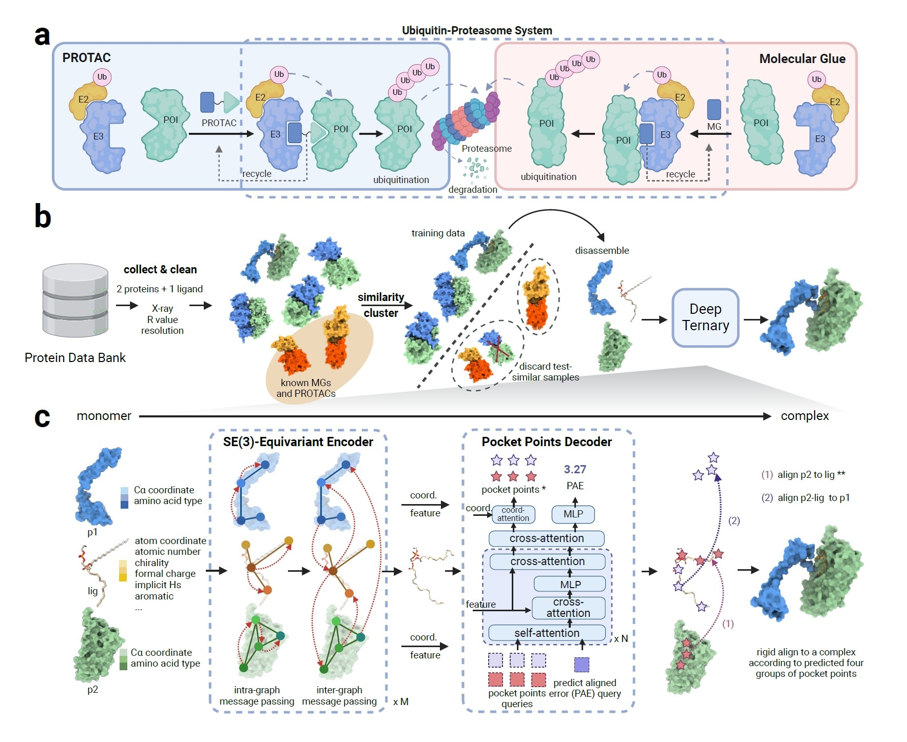

# DeepTernary


SE(3)-Equivariant Ternary Complex Prediction Towards Target Protein Degradation


---

## Overview

DeepTernary is a deep learning-based method for predicting structures of ternary complexes induced by PROTACs and molecule glues (MG(D)). To fulfill our purpose, we first constructed a large-scale dataset of over 20k ternary structures by identifying high-quality complexes from the Protein Data Bank (PDB) that include a small molecule and two proteins. Using this curated data, we trained DeepTernary, an SE(3)-equivariant graph neural network designed for ternary structure prediction. DeepTernary is able to output the conformation of the small molecule and the docking poses of the complex. We evaluated it on existing PROTACs and MG(D)s, achieving DockQ scores of 0.65 and 0.23 with average inference times of about 7 seconds and 1 second, respectively, on the PROTAC and MG(D) benchmarks. The ability of DeepTernary to generalize from a non-PROTAC/MG PDB dataset to PROTAC/MG ternary structures demonstrates its capability to extract common interaction patterns and principles governing ternary structure formation induced by small molecules rather than merely memorizing existing structures. Furthermore, the calculated buried surface area (BSA) based on our predicted PROTAC structures aligns well with existing literature, suggesting high degradation potential when BSA ranges between 1100 and 1500. 




## Usage

### Install

#### Hardware requirements

DeepTernary support inferencing on a standard computer with or without GPUs.

#### Software requirements

##### OS Requirements

This codebase is supported for Linux, macOS, and Microsoft, as long as it could install PyTorch.

##### Python Dependencies

1. Please follow the PyTorch document to install PyTorch: https://pytorch.org/get-started/locally/.

2. Install mmengine by: `pip install mmengine`

3. Install the dependencies by: `pip install -r requirements.txt`

The experiments are conducted under following envrionment, but other versions should also work with this codebase. It typically takes 10 minues to install all the dependecies.

- Red Hat Enterprise Linux release 8.8
- Python==3.10.3
- PyTorch==2.3.1+cu121
- mmengine==0.10.3


### Prediction

To perform evaluation, follow these steps:
1. Download the pre-trained checkpoint from [this link](https://zenodo.org/records/12727661). The testing benchmark pdb files are also included in this zip file.
2. Unzip the file and move it to the `output/` directory.
3. Execute the following command to evaluate the model:

```Bash
python predict_cpu.py output/DeepTernary/PROTAC

python predict_cpu.py output/DeepTernary/MGD
```

Typically, the results for every test sample should be shown in 5 minues.

For PROTAC prediction with different PROTACs, there is a simple API in `predict_btk.py`:

```Python

data_dir = 'output/protac_new'
name = '8QU8_A_F_WYL'
cfg.save_dir = f'output/pred_{name}'
predict_one_unbound(
    name,
    lig_path=f'{data_dir}/{name}/ligand.pdb',
    p1_path=f'{data_dir}/{name}/unbound_protein1.pdb', p2_path=f'{data_dir}/{name}/unbound_protein2.pdb',
    lig1_mask_path=f'{data_dir}/{name}/lig1_mask.pdb', lig2_mask_path=f'{data_dir}/{name}/unbound_lig2.pdb',
    unbound_lig1_path=f'{data_dir}/{name}/unbound_lig1.pdb', unbound_lig2_path=f'{data_dir}/{name}/unbound_lig2.pdb',
    cfg=cfg)

```

This will save the predicted ternary complex pdb file in the `cfg.save_dir` directory.

### Training

For training with 4 GPUs, use the command below:

```Bash
bash tools/dist_train.sh projects/equibind/configs/protac.py 4
```
