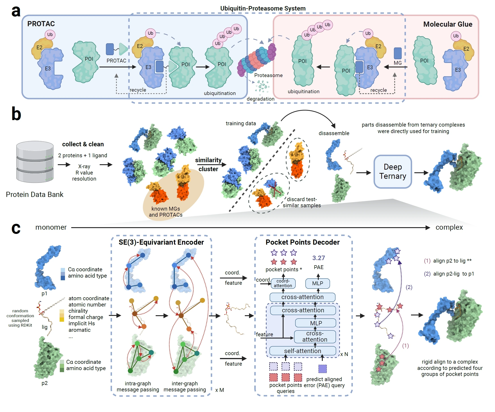

# DeepTernary


SE(3)-Equivariant Ternary Complex Prediction Towards Target Protein Degradation


---

## Update
- **2025-11-29**: Release preprocessed data for training.
- **2025-11-27**: Add a user-friendly prediction script: [predict.py](predict.py).
- **2025-07-21**: Release all ternary pdb files and support automatic download of ideal ligands.
- **2025-05-25**: Since the journal doesn't allow including thanks to anonymous referees, we would like to express our gratitude to the reviewer 3 for providing the RDKit codes to rigidly fix PROTAC chemical handles during conformational searches.

## Overview

DeepTernary is a deep learning-based method for predicting structures of ternary complexes induced by PROTACs and molecule glues (MG(D)). To fulfill our purpose, we first constructed a large-scale dataset of over 20k ternary structures by identifying high-quality complexes from the Protein Data Bank (PDB) that include a small molecule and two proteins. Using this curated data, we trained DeepTernary, an SE(3)-equivariant graph neural network designed for ternary structure prediction. DeepTernary is able to output the conformation of the small molecule and the docking poses of the complex. We evaluated it on existing PROTACs and MG(D)s, achieving DockQ scores of 0.65 and 0.23 with average inference times of about 7 seconds and 1 second, respectively, on the PROTAC and MG(D) benchmarks. The ability of DeepTernary to generalize from a non-PROTAC/MG PDB dataset to PROTAC/MG ternary structures demonstrates its capability to extract common interaction patterns and principles governing ternary structure formation induced by small molecules rather than merely memorizing existing structures. Furthermore, the calculated buried surface area (BSA) based on our predicted PROTAC structures aligns well with existing literature, suggesting high degradation potential when BSA ranges between 1100 and 1500. 



## TernaryDB

The collected **TernaryDB** dataset can be downloaded [here](https://github.com/youqingxiaozhua/DeepTernary/releases/download/v1.0.1/TernaryDB.tar.gz).

The PROTAC, the `val.csv` and `test.csv` have three columns, they represent complex_id, unbound structure for p1 and p2, respectively.

The similarity clustered results for the training examples are also included in the corresponding folder named `train_clusters.json`.


File structure:

```
TernaryDB
├── pdbs
│   ├── 1A2Y_A_C_PO4
│   │   └── gt_complex.pdb
│   ...
├── MGD
│   ├── test.txt
│   ├── train_clusters.json
│   ├── train.txt
│   └── val.txt
└── PROTAC
    ├── test.csv
    ├── train_clusters.json
    ├── train.txt
    └── val.csv
```

Please place the `TernaryDB` folder in the `data` folder of this codebase, otherwise, you need to modify the `DATA_BASE` variable in `deepternary/models/path.py` to the correct path.

## Usage

### Install

#### Hardware requirements

DeepTernary support inferencing on a standard computer with or without GPUs.

#### Software requirements

##### OS Requirements

This codebase is supported for Linux, macOS, and Microsoft, as long as it could install PyTorch.

##### Python Dependencies

1. Please follow the PyTorch document to install PyTorch: https://pytorch.org/get-started/locally/.
    For example, for PyTorch 2.3.1 with CUDA 12.1, you can use the following command:
    
    ```bash
    pip install torch==2.3.1+cu121 --index-url https://download.pytorch.org/whl/cu121
    ```

2. Install the dependencies by: `pip install -r requirements.txt`

The experiments are conducted under following envrionment, but other versions should also work with this codebase. It typically takes 10 minues to install all the dependecies.

- Red Hat Enterprise Linux release 8.8
- Python==3.10.3
- PyTorch==2.3.1+cu121
- mmengine==0.10.3


### Config Files

The model is defined in the following config file, please use the corresponding config file for the task.

| Task   | Config File                    |
|--------|-------------------------------------------------------|
| PROTAC | [deepternary/configs/protac.py](deepternary/configs/protac.py) |
| MGD    | [deepternary/configs/glue.py](deepternary/configs/glue.py)       |


### Evaluation

To perform evaluation, follow these steps:
1. Download the pre-trained checkpoint and PROTAC unbound structures from [this link](https://github.com/youqingxiaozhua/DeepTernary/releases/download/v1.0.0/output.zip).
2. Unzip the folder and move it to the root directory of this codebase.
3. Execute the following command to evaluate the model:


```Bash
# download the pre-trained checkpoints and unbound structures
wget https://github.com/youqingxiaozhua/DeepTernary/releases/download/v1.0.0/output.zip

# unzip data
unzip output.zip

# evaluate on the PROTAC test set
python predict_cpu.py output/checkpoints/PROTAC

# MGD need to process the test data, see `TernaryDB/MGD/test.txt`
# python predict_cpu.py output/checkpoints/MGD
```
Typically, the results for every test sample should be shown in 5 minues.


### Prediction

- PROTAC example (unbound setting, multi-seed):

```Bash
python predict.py \
    --task PROTAC \
    --name 5T35-no-correct \
    --lig output/protac22/5T35_H_E_759/ligand.pdb \
    --p1 output/protac22/5T35_H_E_759/unbound_protein1.pdb \
    --p2 output/protac22/5T35_H_E_759/unbound_protein2.pdb \
    --unbound-lig1 output/protac22/5T35_H_E_759/unbound_lig1.pdb \
    --unbound-lig2 output/protac22/5T35_H_E_759/unbound_lig2.pdb \
    --lig1-mask output/protac22/5T35_H_E_759/unbound_lig1.pdb \
    --lig2-mask output/protac22/5T35_H_E_759/unbound_lig2.pdb \
    --outdir ./results/protac_case \
    --seeds 40
```

- MGD example (bound setting, single seed):

```Bash
python predict.py \
    --task MGD \
    --name 6HR2-case \
    --lig data/TernaryDB/pdbs/6HR2_F_E_FWZ/ligand.pdb \
    --p1 data/TernaryDB/pdbs/6HR2_F_E_FWZ/protein1.pdb \
    --p2 data/TernaryDB/pdbs/6HR2_F_E_FWZ/protein2.pdb \
    --outdir ./results/mgd_case
```

- Arguments
    - `--task`: "PROTAC" or "MGD".
    - `--lig`: ligand file (`.pdb` or `.sdf`).
    - `--p1`, `--p2`: protein PDBs.
    - `--unbound-lig1`, `--unbound-lig2` (PROTAC): unbound anchor/warhead PDBs.
    - `--lig1-mask`, `--lig2-mask` (PROTAC): mask molecules used to map PROTAC indices to anchor/warhead atoms. They can be a subset of the corresponding unbound ligs. This is required because sometimes RDKit can not find the matches between anchor/warhead and the given PROTAC. To generate them, just align `--unbound-lig1` and `--unbound-lig2` to the given `--lig`, make sure the corresponding atoms are very close.
    - `--outdir`: directory to save outputs.
    - `--seeds`: number of random conformers (default 40 for PROTAC, 1 for MGD).
    - `--device`: `cuda` or `cpu` (defaults to CUDA if available).
    - `--no-correct`: disable EquiBind-based ligand pose correction.

- Outputs
    - Per-seed predicted complex PDBs saved to `--outdir`, named like `complex_pred_<name>_<seed>.pdb`.
    - A summary CSV `summary_<name>.csv` in `--outdir` listing `seed`, predicted protein2 RMSD surrogate (`pred_p2_rmsd`), a simple clash ratio, and the path to each complex PDB.

- Notes on PROTAC matching
    - The PROTAC anchor/warhead masks are first matched to the full PROTAC using RDKit substructure matching.
    - If RDKit cannot find a full substructure match, the script falls back to a distance-based Hungarian assignment with atom-type penalties and logs a warning, e.g.:
      - `[Warn] RDKit GetSubstructMatch failed ...; using distance-based matching`
      - `[DistanceMatch] lig1: mean_dist=..., mismatches=.../...`

The top-1 result is the one with the lowest predicted P2 RMSD in the summary CSV.

### Training


#### Data Preparation

To accelerate training, we have pre-generated 50 conformations per structure and cached the results. This skips the time-consuming steps of parsing PDB files, generating random conformations, and constructing graphs. For implementation details, please refer to [tools/data_preparation/preprocess.py](tools/data_preparation/preprocess.py).

#### Download and Setup

1. Download the preprocessed data, ideal ligands, and raw PDBs from [Google Drive](https://drive.google.com/drive/folders/1BHRINig7nQUvNc3uv5rp2e67EmATQew5?usp=sharing).

2. Extract the files into data/TernaryDB so the directory structure matches the layout below.

3. Note: If you choose a different directory, you must update the path configurations in [deepternary/models/path.py](deepternary/models/path.py).


```
data/TernaryDB
├── preprocessed  # PREPROCESSED_PATH
│   └──  pdb2311_merge  # extracted from preprocessed/pdb2311_merge.tar 
├── ligand_ideal  # IDEAL_PATH, extracted from ligand_ideal.tar
└── pdbs  # PDB_PATH, extracted from pdb2311_merge.tar.xz
```

#### Start Training
For training with 2 GPUs, use the command below:

```Bash
bash tools/dist_train.sh deepternary/configs/protac.py 2
```

Codes for model and dataset are located under `deepternary/models/`, their defination is in the config files under `deepternary/configs/`.


# Citing this work

If you find this codebase, the model useful, please cite our paper:

```BibTeX
@article{xueDeepTernary2025,
  title = {{{SE}}(3)-Equivariant Ternary Complex Prediction towards Target Protein Degradation},
  shorttitle = {{{DeepTernary}}},
  author = {Xue, Fanglei and Zhang, Meihan and Li, Shuqi and Gao, Xinyu and Wohlschlegel, James A. and Huang, Wenbing and Yang, Yi and Deng, Weixian},
  year = {2025},
  month = jul,
  journal = {Nature Communications},
  volume = {16},
  number = {1},
  pages = {5514},
  publisher = {Nature Publishing Group},
  issn = {2041-1723},
  doi = {10.1038/s41467-025-61272-5},
  urldate = {2025-07-22},
  langid = {english}
}
```
